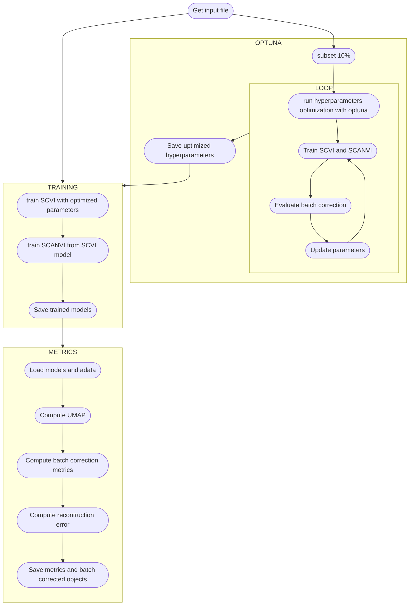

# Batch correction

To run the batch correction I decided to use [scVI](https://github.com/scverse/scvi-tools). All the environment is in a container and can be run in any machine with docker or singularity installed. THe container allows GPU accelleration

## how to run

Clone the repo and move to [scvi](./scvi)

```
git clone VergaJU/BoneMarrow_scRNA-Seq

cd Batch-correct/scvi
```

### Get container

```
docker pull vergaju/batch_correct:v3
docker run --gpus all --rm -it -v $(pwd):/home/data -w /home/data vergaju/batch_correct:v3 bash
```

### Usage

The bash [script](./scvi/train.sh) runs an hyperparametrers optimization with [optuna](https://optuna.org/). Specifically it tries to optimize:
- number of nodes per layer
- number of layers
- number of latent dimensions

The optimization subset the 10% of cells and run both SCVI and SCANVI training with early stopping parameters.


```
train.py -h
usage: train.py [-h] [-i INPUT_OBJECT] [-o OUTPUT_PREFIX] [-b BATCH_KEY] [-l LABEL_KEY] [-t TEST]

Input/Output files and method parameters

options:
  -h, --help            show this help message and exit
  -i INPUT_OBJECT, --input_object INPUT_OBJECT
                        Input h5ad file.
  -o OUTPUT_PREFIX, --output_prefix OUTPUT_PREFIX
                        Name to use as prefix for saving objects.
  -b BATCH_KEY, --batch_key BATCH_KEY
                        Obs key defining batch.Default batch
  -l LABEL_KEY, --label LABEL_KEY
                        Label key. Default label
  -t TEST, --test TEST  Run test parameters. Default False


```

Top evaluate the preformances (scib)[https://scib.readthedocs.io/en/latest/] is used to compute:
- Biological preservation:
  - ari (adjusted rand index) between clusters and cell labes
  - isolated_labels_asw : isolated labels average silouhette
  - cLISI: cell type LISI
  - nmi: Normalized Mutual Information
  - silouette: cell types
- Batch effect removal:
  - graph_connectivity
  - iLISI: integration LISI
  - silouhette_batch


The optimized parameters are saved in :


```
<OUTPUT_PREFIX>_params.json
```

And can be used to run the complete training of SCVI and SCANVI:


```
batch_correct.py -h
usage: batch_correct.py [-h] [-i INPUT_OBJECT] [-o OUTPUT_PREFIX] [-b BATCH_KEY] [-l LABEL_KEY] [-p PARAMS]

Input/Output files and method parameters

options:
  -h, --help            show this help message and exit
  -i INPUT_OBJECT, --input_object INPUT_OBJECT
                        Input h5ad file.
  -o OUTPUT_PREFIX, --output_prefix OUTPUT_PREFIX
                        Name to use as prefix for saving objects.
  -b BATCH_KEY, --batch_key BATCH_KEY
                        Obs key defining batch.Default batch
  -l LABEL_KEY, --label LABEL_KEY
                        Label key. Default label
  -p PARAMS, --params PARAMS
                        JSON file with parameters
```

The output consists of:
- SCVI trained model
- SCANVI trained model


Finally the script (metrics)[scvi/metrics.py] provide metrics on the batch correction, reconstruction error (predicted values from the autoencoder) and computes UMAP for original, SCVI and SCANVI corrected datasets.

```
metrics.py -h
usage: metrics.py [-h] [-i INPUT_OBJECT] [-o OUTPUT_PREFIX] [-b BATCH_KEY] [-l LABEL_KEY]

Input/Output files and method parameters

options:
  -h, --help            show this help message and exit
  -i INPUT_OBJECT, --input_object INPUT_OBJECT
                        Input h5ad file.
  -o OUTPUT_PREFIX, --output_prefix OUTPUT_PREFIX
                        Name to use as prefix for saving objects.
  -b BATCH_KEY, --batch_key BATCH_KEY
                        Obs key defining batch.Default batch
  -l LABEL_KEY, --label LABEL_KEY
                        Label key. Default label
```

Flowchart:


```mermaid

flowchart TB
A([Get input file])
    subgraph OPTUNA
    direction RL
    B([subset 10%])
    B --> C([run hyperparameters optimization with optuna])
    subgraph LOOP
    C --> D([Train SCVI and SCANVI])
    D --> E([Evaluate batch correction])
    E --> F([Update parameters])
    F --> D
    end
    G([Save uptimized hyperparameters])
    end
    subgraph TRAINING
    direction TB
    I([train SCVI with optimized parameters])
    I --> J([train SCANVI from SCVI model])
    J --> K([Save trained models])
    end
    subgraph METRICS
    direction TB
     L([Load models and adata])
    L --> M([Compute UMAP])
    M --> N([Compute batch correction metrics])
    N --> O([Compute recontruction error])
    O --> P([Save metrics and batch corrected objects])
    end
    A --> B
    A --> TRAINING
    LOOP --> G
    G --> TRAINING
    K --> METRICS

```