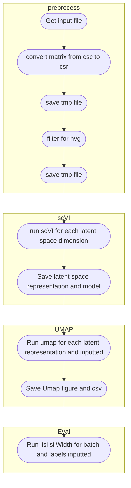

# Batch correction

To run the batch corrction I decided to use [scVI](https://github.com/scverse/scvi-tools) (from [scArches](https://github.com/theislab/scarches) 0.5.3). All the environment is in a container and can be run in any machine with singularity installed.

## how to run

Clone the repo and move to [scvi](./scvi)

```
git clone VergaJU/BoneMarrow_scRNA-Seq

cd Batch-correct/scvi
```

### Get container

```
singularity pull docker://vergaju/batch_correct:v2
```

### Usage

The bash [script](./scvi/run_scvi.sh) contains all the pipeline to run the batch correction with different latent dimensions and neighbours for umap computation.

```
Run parameter optimization for scVI/scANVI.

Syntax: scriptTemplate [-csv|b|c|h|]
options:
c     csv file containing file paths, hvg and latent space dimension for each run
        e.g.
             path/to/file,number hvg,number latent space
b     Batch key
f     first key (cell type)
s     second key (optional, another label key)
h     Print this Help.
```


Flowchart:

