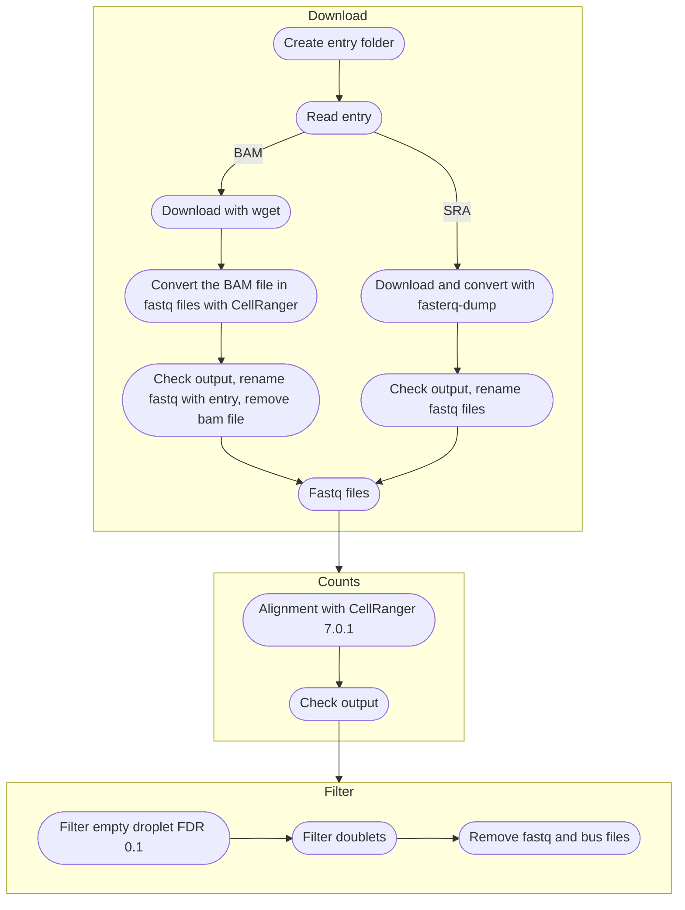

# Pre processing

The pre processing consist on:
- Data retrieval:
    - sratoolkit fasterq-dump for sra entries
    - wget for bam entries
- Conversion of the files in fastq format:
    - sratoolkit fasterq-dump for sra entries
    - cellranger for bam files
- Alignment with CellRanger 7.0.1 and CellRanger Index
- Empty droplets filtration with EmptyDrops
- Doublets removal using scDblFinder




## Usage: 

All the pipeline is organised in a Docker container to ensure reproducibility and portability of it, the container is available [here](https://hub.docker.com/repository/docker/vergaju/pre-process).

The container contains the seguent softwares:
- sratoolkit (2.11.3)
- cellranger (7.0.1)
- DropletUtils (1.14.0)
- scDblFinder (1.8.0)

The index is the built-in from CellRanger 2020-A (July 7, 2020) [here](https://cf.10xgenomics.com/supp/cell-exp/refdata-gex-GRCh38-2020-A.tar.gz)

The input file is a csv file (samed samples.csv) organised as follow:
- patient or experiment
- name of the run
- entry of the run/link
- technology


Headers aren't needed and the technology supported at today are:
- 10xv2
- 10xv3


example:

```
SAMN18822752,SRR14295357,SRR14295357,10xv3
SAMN18822743,SRR14295358,<link to bam file>,10xv3
```

The folder must contain the reference genome from CellRanger and the file with `samples.csv`
### Run with docker

To obtain the latest version run:
```
docker pull vergaju/pre-process:latest
```

The working directory with the input file has to be mounted in the `/home/` directory of the container using the `-v`, an example of the command to run the pre-processing is:

```
docker container run -v $(pwd):/home/ vergaju/pre-process:latest
```

### Run with singularity

To obtain the latest version for singularity run:
```
singularity pull docker://vergaju/pre-process:latest
```

Since singularity can directly communicate with the global environment the container can be run directly without mounting the directory inside the container and using input files with different name. An example:
```
singularity exec pre-process_singularity.sif pre_process.sh samples.csv
```

## Steps:

For each row (entry) two nested folders will be created:
```
Parent Dir
└── Patient
     └── Name
```

### Data retrival

Bam files created with CellRanger have to be inserted as links, wget will download the file. CellRanger then will convert back the bam file to fastq files:

```
# download
wget -c <link>
filename=$(ls) # update filename

## Use cellranger to get the fastq files
~/.cellranger-6.1.2/lib/bin/bamtofastq \
    --nthreads=6 \
    --reads-per-fastq=100000000000 \
    --traceback \
    ${filename} \
    ./fastq/ \
    |& tee -a bamtofastq.LOG
```

The log file will be saved in the file `bamtofastq.LOG`.

Sra entries will be automatically downloaded and converted using `fasterq-dump`:

```
fasterq-dump <entry> -o <entry> -O fastq/ -S --include-technical |& tee -a fasterq-dump.LOG
cache-mgr -c ~/.sratoolkit.2.11.3-ubuntu64/cache/
```

The fastq files will be named as the entry. The log file frm fasterq-dump will be saved as `fasterq-dump.LOG`.

### Alignment and counts:

All the fastq file will be processed with CellRanger:

```
    cellranger count \
    --id cr \
    --transcriptome /home/refdata-gex-GRCh38-2020-A \
    --fastqs ./fastq \
    --sample ${1} \
    --nosecondary \
    --include-introns false \
    --no-bam |& tee -a cellranger.LOG
```

As previously the log file will be saved in `cellranger.LOG`.

### Empty/doublets filtering

Finally, the matrix obtained from kb fill be filtered from empty cells (FDR 0.1)  and doublets:

```
filter_empty_v2.R ./kb_out/counts_unfiltered/cellranger/ 0.1 |& tee -a filter_empty.LOG
```

the log file will be saved here: `filter_empty.LOG`

### Cleanup files

Since fastq and bus files are big and occupy a lot of storage, the last step is to remove them:

```
mv $(pwd)/cr/outs/filtered_feature_bc_matrix/ out/
mv $(pwd)/cr/outs/web_summary.html out/
rm -fr cr
rm -fr fastq/
find . -name "*.fastq" -delete
find . -name "*.bus" -delete
```

The final structure of the directory for each row will be as follow:
```
.
├── main.LOG
└── SAMN15892704
    └── SRR12506863
        ├── fasterq-dump.LOG
        ├── fastq
        ├── filter_empty.LOG
        ├── cellranger.LOG
        └── out
              ├── counts_filtered
              │   ├── barcodes.tsv
              │   ├── genes.tsv
              │   └── matrix.mtx
              ├── filtered_feature_bc_matrix
              │   ├── barcodes.tsv
              │   ├── genes.tsv
              │   └── matrix.mtx
              └── web_summary.html
```

- `main.LOG` Contains the LOG file from the main script ([pre_process.sh](./scripts/pre_process.sh)), one for all the entries inputted.
- Each entry has it's log files inside the entry folder.
- `kout` is the folder containing all the results from the pre-processing:
    - `counts_filtered` contains matrix, barcodes and genes filtered with EmptyDroplets and scDblFinder. These files will be considered for the next Quality Control step.
    - `filtered_feature_bc_matrix` is the original output from CellRanger
    - `web_summary.html` contains the summary from CellRanger


